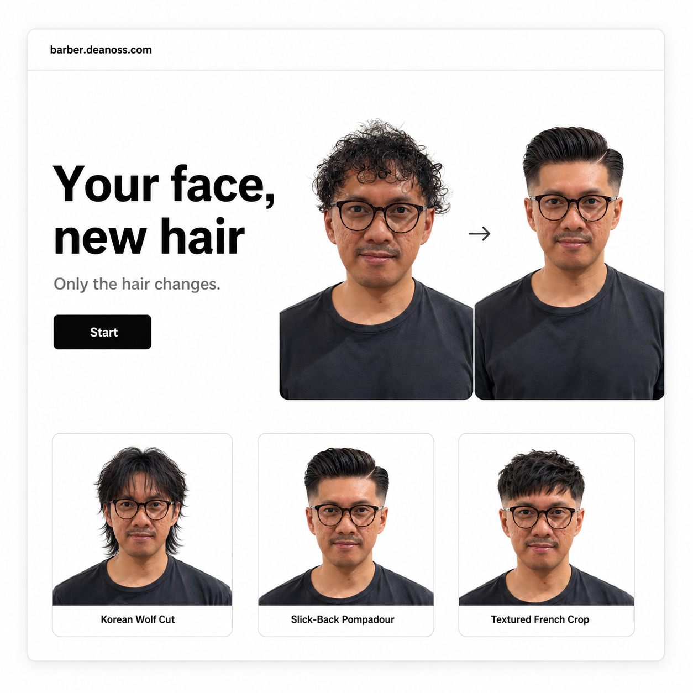

# Barber Studio

<p align="center">
  
</p>

Barber Studio is an in-shop AI hairstyle preview station for barbers and salons. Staff use it during consultation: pick a customer type, select hairstyles from the shop catalog, capture or upload a face photo, and generate previews before the cut starts.

The app is built for a private shop kiosk first. It is not a booking platform, marketplace, or multi-tenant SaaS product.

## What It Does

- Guides staff through a fast chair-side hairstyle preview workflow.
- Supports Men, Women, and Kids catalogs.
- Lets the shop owner manage provider settings, catalog rows, cover images, watermarks, password, and history from `/admin`.
- Generates either individual style previews or one labeled grid lookbook.
- Streams job progress with Server-Sent Events so long generations do not block the UI.
- Keeps per-customer tabs in the browser so multiple customers can be in progress.
- Stores shop-mode settings and job history under `data/`.
- Can be built as a public bring-your-own-key showcase with no admin and no server-side generation.

## Runtime Modes

| Mode | Use case | Key and data behavior |
| --- | --- | --- |
| Shop kiosk | Private shop deployment | Server stores the provider key in `data/settings.json`; `/admin` is enabled; customer input and generated images are saved under `data/jobs/`. |
| Public showcase | Public demo site | Build with `NEXT_PUBLIC_SHOWCASE=1`; `/admin` and `/api/generate*` return `410`; the browser stores the visitor key in `localStorage` and calls the provider directly. |

Use shop kiosk mode for real shops. Use public showcase mode only for demo or marketing environments.

## Quick Start

Prerequisites:

- Node.js 20+
- Corepack enabled for Yarn 4

```bash
corepack enable
yarn install
cp .env.local.example .env.local
yarn dev
```

Open `http://localhost:3000`.

On first shop-mode run, the app creates `data/settings.json`. Open `http://localhost:3000/admin`, sign in with `ADMIN_PASSWORD` or the default `change-me`, then add the provider key and change the admin password.

## Docker Compose

```bash
cp .env.local.example .env
docker compose up -d
```

Open `http://localhost:3000`.

`docker-compose.yml` runs `deanopen/barber-ai:${BARBER_IMAGE_TAG:-latest}` and mounts the `barber-data` volume at `/app/data`.

Useful overrides:

```bash
BARBER_PORT=8080 docker compose up -d
BARBER_IMAGE_TAG=sha-abc1234 docker compose up -d
```

## Public Showcase Build

The showcase flag is a build-time flag. Changing it requires rebuilding the app or Docker image.

Local:

```bash
yarn build:showcase
NEXT_PUBLIC_SHOWCASE=1 yarn start
```

Docker:

```bash
docker build --build-arg NEXT_PUBLIC_SHOWCASE=1 -t barber-ai:showcase .
docker run --rm -p 3000:3000 -e NEXT_PUBLIC_SHOWCASE=1 barber-ai:showcase
```

## Add More Hairstyles

The easiest way is through the admin panel:

1. Open `/admin`.
2. Go to **Hairstyle prompts**.
3. Choose Men, Women, or Kids.
4. Add a row with:
   - `Section`: grouping label shown in the style picker.
   - `Name`: short customer-facing hairstyle name.
   - `Reference image URL`: optional image for the picker card.
   - `Prompt description`: concrete visual instructions for the model.
5. Save settings.

Write prompt descriptions like a stylist would specify the result: length, parting, fringe, fade/taper, volume, texture, color, finish, and any hard constraints. Avoid vague rows like "modern haircut"; the model needs visible details.

To change the seed catalog for new installs, edit `PUBLIC_DEFAULTS.prompts` in `lib/defaults.ts`. Add local reference images under `public/style-references/<category>/` and point `imageUrl` at `/style-references/...`.

## UI Styling Notes

Global visual tokens live in:

- `app/theme.tsx`: Ant Design dark theme tokens.
- `app/globals.css`: kiosk-specific classes such as cards, capture UI, and style picker cards.

Keep the product practical and shop-facing. Admin screens should stay compact and operational. Kiosk screens can be more visual, but they should still prioritize clear selection, camera capture, progress, and saving/presenting results.

## Configuration

| Variable | Scope | Purpose |
| --- | --- | --- |
| `OPENAI_API_KEY` | server runtime | Optional fallback key when no key is saved in `/admin`. Ignored in showcase mode. |
| `ADMIN_PASSWORD` | first shop-mode run | Seeds `data/settings.json` only when the settings file is created. Change it in `/admin` afterward. |
| `NEXT_PUBLIC_SHOWCASE` | build and runtime | Set to `1` for public showcase mode. Leave empty for shop kiosk mode. Must be set during build because it is inlined into the client bundle. |
| `PORT` | container runtime | Container port. Defaults to `3000`. |
| `BARBER_PORT` | compose host | Host port exposed by Docker Compose. Defaults to `3000`. |
| `BARBER_IMAGE_TAG` | compose image | Docker image tag. Defaults to `latest`. |

Admin-managed settings include provider key, optional OpenAI-compatible `baseURL`, model id, generation mode, count, size, quality, watermark, category cover images, hairstyle catalog rows, admin password, and history deletion.

## Provider Costs

The default provider is OpenAI's `gpt-image-2`. OpenAI bills by token; in practice this lands at the following per-image output cost:

| Quality | 1024×1024 | 1024×1536 | 1536×1024 |
| --- | --- | --- | --- |
| `low` | ~$0.006 | ~$0.005 | ~$0.005 |
| `medium` | ~$0.053 | ~$0.041 | ~$0.041 |
| `high` (default) | ~$0.211 | ~$0.165 | ~$0.165 |

Inputs are billed separately: $5.00 / 1M text tokens, $8.00 / 1M image tokens, $2.00 / 1M cached tokens. The customer face photo plus the prompt usually adds well under one cent per generation. The Batch API (not currently used by this app) cuts both input and output rates by 50%.

A typical kiosk session at the default `high` quality and `1024x1024` size:

- **Individual mode** with 4 styles selected: about **$0.85** per customer.
- **Grid mode** with 1 composite plus 2 full-detail renders: about **$0.65** per customer.
- Switch quality to `medium` in `/admin` to spend roughly **$0.05** per image — about 4× cheaper, and usually adequate for chair-side previews. `low` is ~$0.006 per image but visibly degraded.

Rates change. Confirm against the [OpenAI API pricing page](https://developers.openai.com/api/docs/pricing) before forecasting monthly spend.

## Data and Privacy

Shop kiosk mode writes runtime data to disk:

- `data/settings.json`: provider key, admin password, model settings, catalog, category images, and watermark settings.
- `data/jobs/<jobId>/input.bin`: customer input photo.
- `data/jobs/<jobId>/input.meta.json`: input MIME type.
- `data/jobs/<jobId>/state.json`: job state and generated base64 image payloads.

In-memory jobs are kept for about 1 hour. Disk job folders are kept for about 30 days and can also be deleted from admin history.

Treat `data/` as customer data. It is gitignored and should be protected by host or volume permissions. Public showcase mode does not read or write `data/`.

## Project Layout

```text
app/
  page.tsx                         kiosk wizard, customer tabs, SSE resume
  admin/page.tsx                   admin settings and history
  components/
    FaceCapture.tsx                camera/upload capture flow
    PhotoCard.tsx                  category cards
    ShowcaseSetup.tsx              public BYOK setup modal
    Slideshow.tsx                  full-screen presentation view
  api/
    status/route.ts
    generate/route.ts
    generate/[id]/stream/route.ts
    generate/[id]/retry/route.ts
    generate/[id]/detail/route.ts
    admin/...
lib/
  defaults.ts                      client-safe defaults and catalog
  settings.ts                      JSON settings persistence and migration
  jobs.ts                          job store, disk persistence, SSE events
  history.ts                       admin history readers/deleter
  generate-runner.ts               server-side provider calls
  client-generate.ts               showcase browser provider calls
  prompts.ts                       browser-safe prompt templates
  watermark.ts                     server Sharp watermark
  client-watermark.ts              browser canvas watermark
  showcase.ts                      showcase mode flag
public/
  screenshots/
  style-references/
data/                              runtime only, gitignored
```

## API Surface

| Route | Mode | Purpose |
| --- | --- | --- |
| `GET /api/status` | public | Returns safe kiosk settings and the showcase flag. |
| `POST /api/generate` | shop | Creates a background generation job. |
| `HEAD /api/generate/[id]/stream` | shop | Checks whether a job can be resumed. |
| `GET /api/generate/[id]/stream` | shop | Streams `snapshot`, `item`, `done`, and `ping` SSE events. |
| `POST /api/generate/[id]/retry` | shop | Re-runs one item by style name. |
| `POST /api/generate/[id]/detail` | shop | Adds a full-detail render from a grid pick. |
| `POST /api/admin/login` | shop | Creates the admin cookie. |
| `DELETE /api/admin/login` | shop | Clears the admin cookie. |
| `GET /api/admin/settings` | shop/admin | Reads full settings, including secrets. |
| `POST /api/admin/settings` | shop/admin | Saves settings. |
| `GET /api/admin/history` | shop/admin | Lists persisted jobs. |
| `DELETE /api/admin/history/[id]` | shop/admin | Deletes one persisted job folder. |
| `GET /api/admin/history/[id]/input` | shop/admin | Returns the original input photo. |
| `GET /api/admin/history/[id]/items/[idx]` | shop/admin | Returns one generated image. |

## Contributing

1. Create a focused branch.
2. Enable Corepack and install dependencies with `yarn install`.
3. Keep shop kiosk and public showcase behavior separate.
4. If generation prompts change, keep `lib/generate-runner.ts` and `lib/prompts.ts` aligned.
5. If API routes, data retention, deployment, or settings change, update `README.md`, `PROJECT_OVERVIEW.md`, and `CLAUDE.md` in the same patch.
6. Do not commit secrets, `data/`, `.env`, `.env.local`, `.next/`, or generated build output.
7. Run verification before handing off.

Recommended checks:

```bash
yarn typecheck
yarn build:next
yarn build
git diff --check
```

`yarn build:next` verifies the Next.js app. `yarn build` currently runs the Next.js build and then the OpenNext Cloudflare build. `yarn lint` is best-effort because the script still points at `next lint`.

## CI, Docker, and Cloudflare

CircleCI and GitHub Actions install with Yarn, typecheck, run best-effort lint, build the app, build the Docker image, and publish to Docker Hub on configured refs.

The package scripts also include OpenNext/Cloudflare commands:

- `yarn build`: Next.js build plus `opennextjs-cloudflare build --skipNextBuild`.
- `yarn build:next`: Next.js build only.
- `yarn preview`: OpenNext Cloudflare preview.
- `yarn deploy`, `yarn deploy:full`, `yarn deploy:only`: Cloudflare deployment helpers.
- `yarn cf-typegen`: Wrangler environment type generation.

Required Docker Hub secrets:

- `DOCKERHUB_USERNAME`
- `DOCKERHUB_TOKEN`

Optional repository variable:

- `DOCKERHUB_REPO`, default `deanopen/barber-ai`

Tag behavior includes `sha-<short-sha>`, `latest` on default branches and version tags, branch tags, semver tags, and optional manual tags from CI.

## Known Limits

- One shared admin password, no RBAC.
- No database; settings and history are file-backed.
- No generation rate limit or queue dashboard.
- Customer photos and generated outputs are plaintext files in shop mode.
- Running jobs become failed if the server restarts mid-generation.
- Public showcase calls can fail if the provider blocks browser CORS.
- Docker remains the packaged container path. Cloudflare/OpenNext scripts are present, but Cloudflare account/project configuration still needs to be supplied outside the app code.

## Contact

Questions, bug reports, or shop-deployment help: [hello@deanopen.com](mailto:hello@deanopen.com).
